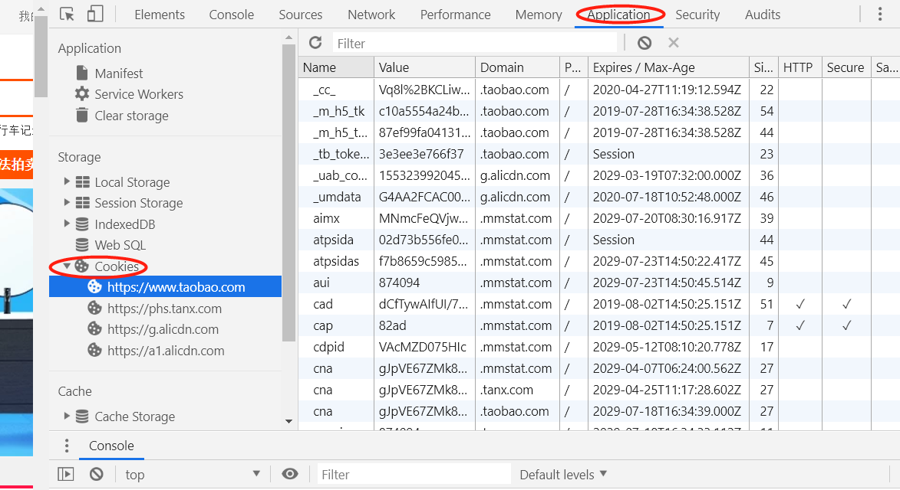

# 什么是Cookie

> 我们先看看一些知名网站是如何使用Cookie的

我们以淘宝PC首页为例，首先我们需要知道怎么查看网站中含有的Cookie。使用Chrome浏览器打开www.taobao.com，打开开发者工具(F12)。然后找到`Application`选项，选项内的左侧有一栏`Cookies`项，这就是我们今天的主题。如图：

我们看Cookies下面有好几个域名，这个就是对应不同域名下面的Cookie。这里我选中的是www.taobao.com这个域名下的所有Cookie，右侧的每一行都代表一条cookie。

我们先来看看Cookie的官方定义：

> HTTP Cookie（也叫Web Cookie或浏览器Cookie）是`服务器发送到用户浏览器`并以文本文件形式保存在电脑上的一小块数据，它会在浏览器下次向同一服务器再发起请求时被携带并发送到服务器上。通常，它用于告知服务端两个请求是否来自同一浏览器，如保持用户的登录状态。Cookie使基于无状态的HTTP协议记录稳定的状态信息成为了可能。

Cookie主要用于以下三个方面：

- 会话状态管理（如用户登录状态、购物车、游戏分数或其它需要记录的信息）
- 个性化设置（如用户自定义设置、主题等）
- 浏览器行为跟踪（如跟踪分析用户行为等）

知识点来自MDN[点击查看](https://developer.mozilla.org/zh-CN/docs/Web/HTTP/Cookies)

