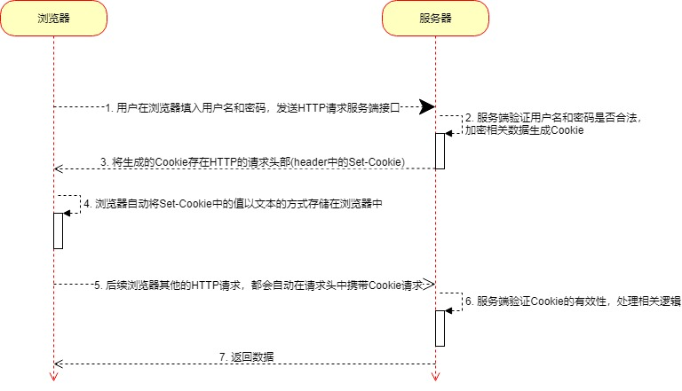
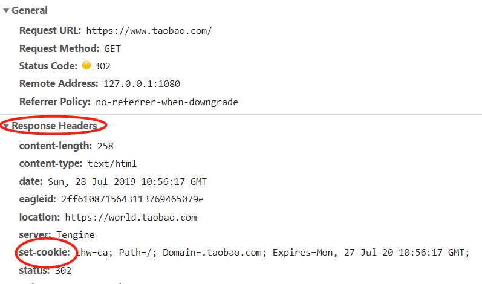
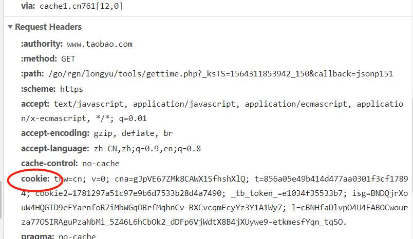

# Cookie原理

我们以最常见的登录为例，先来看看使用Cookie做登录的时序图：

步骤讲解：

1. 用户在登录页面，填入用户名和密码，点击登录，前端将用户名和密码传递给服务器
2. 服务器接收到这个请求，获取用户名和密码，然后到数据库里面核实用户名和密码是否有效，在有效的情况下，后端将用户名和密码封装成`Cookie`
3. 服务端将这个`Cookie`作为HTTP响应头属性`Set-Cookie`的值，回传到浏览器

4. 浏览器接收到带有`Set-Cookie`响应头的请求后，会自动将`Set-Cookie`的值以文本文件的形式存储到浏览器中
5. 用户在网站上请求其他接口时，浏览器会自动将Cookie的值写入到请求头属性`Cookie`中

6. 服务器接收到请求后，获取Cookie的值，拿到Cookie中的用户信息，处理相关业务流程
7. 将浏览器需要的数据返回

- **用户的信息保存在Cookie中，而Cookie保存在浏览器中，那么用户很容易修改Cookie，也就是修改用户信息，导致我们的网站很不安全，容易泄露数据和被攻击。**
