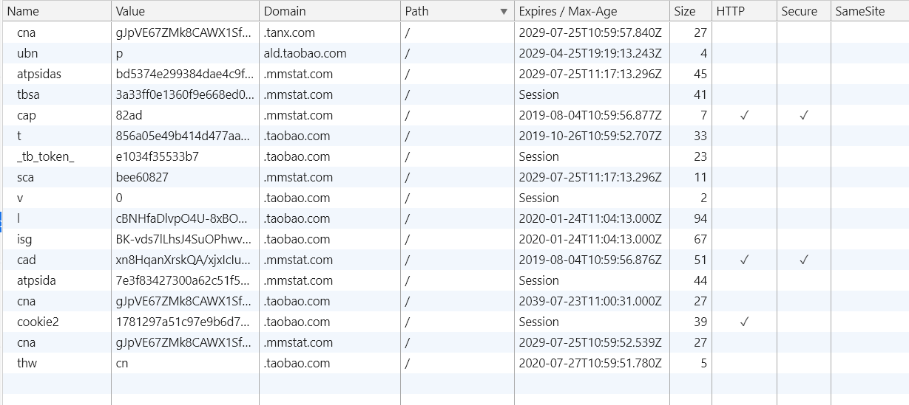

# Cookies属性详解

这一小节，我们学习一下一条Cookie包含哪些属性，我们以Chrome浏览器存储的Cookie为例，想上图看看Chrome上的Cookie有哪些属性：

我们看右侧的上方，也就是我们通常所说的表头，其属性有：

- Name
- Value
- Domain
- Path
- Expires/Max-Age
- Size
- HTTP
- Secure
- SameSite

## 属性详解

### 1. Name和Value

Name和Value在Cookie中的作用和JSON中的key-value是一样的，所以我把他们放在一起讲。

Name表示Cookie的名称，浏览器和服务器都是通过Name属性来获取某个Cookie的值，也就是下面要讲的Value值。

Value代表该条Cookie的值，在现在web应用中，Cookie的值通常用于在服务端获取真正数据的`key`，也就是说，真实的数据并不会传给浏览器，服务端会将真实的数据存储在内存或者`redis`或者其他存储系统中，而这个Cookie值只是获取真实数据的钥匙(key)。举个栗子：

> 小明把宝贝交给小红管理，然后小红把宝贝锁在密码箱(加密封装成Cookie)里面。如果是按照原理图的方式，小红会把密码箱交给一起小明。这样子就相当于，小明带着密码箱在路上大摇大摆的跟别人说：“我有宝贝”。后来小红觉得小明太高调了，于是就把密码箱收回并藏起来，然后给了小明一把钥匙(Value)，当小明需要抚摸一下宝贝时，带着钥匙就是打开密码箱看到藏好的宝贝了。

### 2. Domain和Path

Domain 和 Path 标识定义了Cookie的作用域：即Cookie应该发送给哪些URL，哪些页面可以访问到这些Cookie。我们还是以淘宝为例：

上图中，Domain的值有.tanx.com、ald.taobao.com、.mmstat.com、.taobao.com这四种，.tanx.com、.mmstat.com、.taobao.com为顶级域名，ald.taobao.com为二级域名。我们暂时不讨论.tanx.com、.mmstat.com这两个域名的Cookie，因为他们属于跨域的Cookie。我们先讨论.taobao.com和ald.taobao.com的Cookie的作用域。

在顶级域名下面的URL只能访问和设置顶级域名的Cookie，无法访问二级域名的Cookie。但是二级域名可以访问顶级域名和自身的Cookie，能设置自身的Cookie。如果两个URL想共享同一个Cookie，那么Cookie只能设置在他们的上级域名中，例如两个二级域名想访问同一个Cookie，则需要把这个Cookie存储在顶级域名中。以此类推。

Path是指定了域名或者主机下的哪些路径可以访问或者设置Cookie。上图中我们可以看到，path都是`/`，说明这个域名下面的任何路径都可以访问该Cookie。如果path的值为`/docs`，则表示只有`.taobao.com/docs`下面的路径可以访问该Cookie。

### 3. Expires / Max-Age

该属性代表这条Cookie的超时时间，其值有两种；一种是具体的时间值，一种是字符串`Session`，`Session`也是Expires / Max-Age的默认值

- 当Expires / Max-Age的值设置为具体的时间值，例如：值为2029-07-25T10:59:57.840Z，代表该Cookie在2029年7月25日 10:59:57后就无效了；

**Expires / Max-Age设置的时间值由用户电脑的时间来控制，和服务端没有关系**

- 如果Expires / Max-Age的值为字符串`Session`，则代表该Cookie和Session的有效期是一样的，和前端的知识点关联的话，就是和sessionStorage的有效期一样的，即当浏览器关闭时，该条Cookie就失效了。

**关闭浏览器，不是关闭标签**

### 4. Size

Size的值是Name和Value两者的字符个数之和，举个栗子：

> 有一条Cookie: name=test,value=bugszhou，那么这条Cookie的name字符数为4，value的字符数为8，Size就为12(4 + 8)；

- **每个浏览器对Cookie的Size长度限制不一样的(具体值，自行谷歌)**

### 5. HTTP 和 Secure

HTTP代表的是Cookie的httponly属性。其值为boolean类型有两种：true/false。如果设置为true，则无法通过使用`document.cookie`来获取这条Cookies，只存在于HTTP头部，只能在服务器访问该Cookie；这样设计的目的是为了避免跨域脚本 (XSS) 攻击来窃取Cookie。

> Set-Cookie: test=bugszhou; expires=Thu, 31-Dec-37 23:55:55 GMT; HttpOnly

Secure代表该Cookie只能通过HTTPS协议来互相传递，一般用于传递具有高价值的信息。

> Set-Cookie: test=bugszhou; expires=Thu, 31-Dec-37 23:55:55 GMT; Secure; HttpOnly

### 6. SameSite

SameSite代表该Cookie允许服务器要求某个cookie在跨站请求时不会被发送，从而可以阻止跨站请求伪造攻击（CSRF）。但目前SameSite Cookie还处于实验阶段，并不是所有浏览器都支持。

- **更加权威的资料[点击查看MDN中的说明](https://developer.mozilla.org/zh-CN/docs/Web/HTTP/Cookies)**
