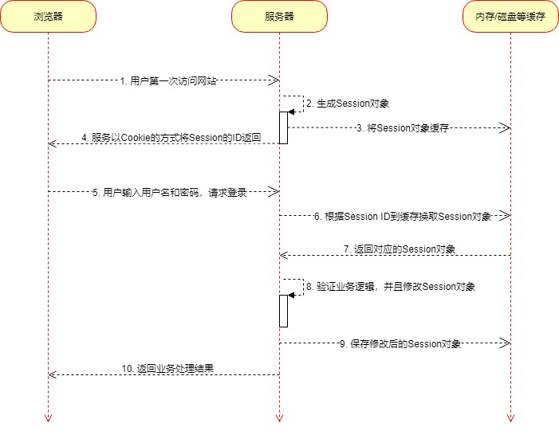
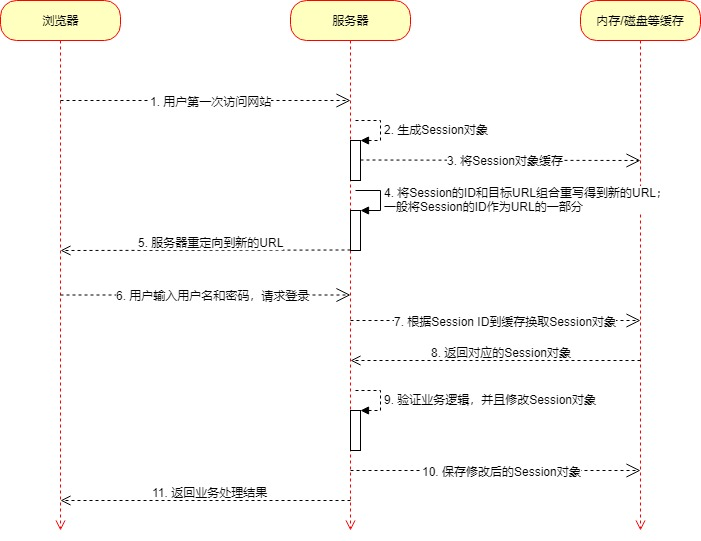

# Session原理

我们还是以登录为例，下面我们来看看网站使用Session的整个时序图：

1. 通过Cookie的方式传递的时序图：

2. 因为用户可以禁用Cookie，导致无法通过Cookie的方式传递Session的ID，所以我们可以使用URL重写的方式来实现，下面为时序图：

以上两种方式，仅仅是传输SessionID的方式不一样，其他的都是一样的：

1. 用户第一次请求服务器，服务器生成Session对象，把Session对象缓存起来
2. 将Session的ID，也就是Session标识，传输给浏览器，之后所有的请求都携带这个ID，服务器就能识别用户了

对比一下Cookie和Session的实现原理，Cookie将信息存放在浏览器中，Session将信息存放在服务器中，Session比Cookie要安全一些，不过Session会多一步缓存的步骤，这在现代服务器中，没有太大的影响。
